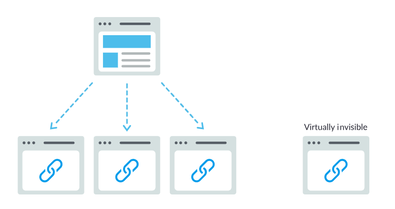
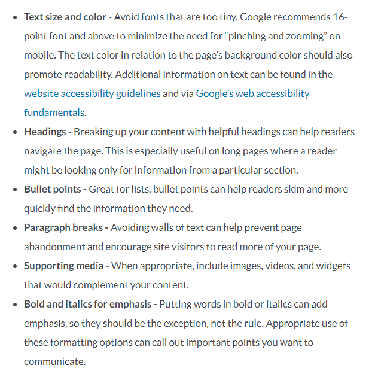

<div align = "center">


```
  So. You want to learn how to properly implement SEO for your website. 
  The question is: how are you going to make things right? 
  Maybe you want your website to look cool and gain traffic. 
  Take it from a guy who's been frozen for 65 years; 
  the only way to really be cool is to follow the rules. 
  We all know what's right. We all know what's wrong.
  Next time any of those black hat SEO turkeys try to convince you to something that you know is wrong, 
  just think to yourself, 

  'What would Captain America do?'
```

</div>

<p align="center"> 
  All jokes aside, the main point of SEO is to improve a websites visibility, traffic, and search rankings.
  Here's a refresher on <a href = "https://www.google.com/search/howsearchworks/">how googles search engine works</a>
  and <a href = "https://support.google.com/webmasters/answer/35291?hl=en">if you need SEO</a>.
  This guide mainly goes over on-page SEO, and does not go over link building and social media tools.
  Ultimately, this guide is meant for people (like myself) who get stuck on improving a website and ask themselves "How can I make this better?" 
  So without further ado...
</p>

<br></br>

## <p align="center"> HERE'S HOW TO DEVELOP AN SEO FRIENDLY WEBSITE </p>

I really enjoyed [Mozs Beginner's Guide to SEO](https://moz.com/beginners-guide-to-seo) & [Googles SEO Starter Guide](https://support.google.com/webmasters/answer/7451184?hl=en). 
All credit for this "guide" goes to them, because this "guide" could not have been written without it. 
I can't recommend strongly enough to read through them.

Please note that this guide does not gurantee that your website will rank #1 on your searches. 
By following the guidelines listed in the upcoming chapters, this guide can only help your website gain the potential of being listed on a SERP.

My guide is written by reading Googles guide, and even they say this:
> This guide won't provide any secrets that'll automatically rank your site first in Google (sorry!), 
> but following the best practices outlined below will hopefully make it easier for search engines to crawl, index and understand your content.

Having said all that, I will try to write this guide in a similar fashion by following Mozs Pyramid of Greatness:

  <div align = "center">
    
  </div>

### <p id = "toc"> Table of Contents </p>
1. [Crawl accessibility](#crawl)
2. [Provide compelling content & optimize keywords](#compellingContentkeywordOptimized)  
3. [Great user experience](#GreatUX)
4. [Share-worthy content](#shareWorthy) that earns links, citations, and amplification
5. [Title, URL, & description](#onsiteOptimazation) to draw high CTR in the rankings
6. [Snippet/schema markup](#snippet/schema) to stand out in SERPs


<br></br>
### <p align="center" id = "crawl"> Crawl Accessibile | [Back to ToC](#toc) </p>

<h4>**In short, make sure your website is crawlable so that engines can reach and index your content.**</h4>

- [ ] Make sure you can access every page of your website through internal links. 
      If you want a search engine to find a page, make sure it can be linked from other pages. 
      If it can't find it, it's good as invisible. [Source](https://moz.com/beginners-guide-to-seo/how-search-engines-operate)

  <div align = "center">
    
  </div>

- [ ] Check for broken links, and fix any that you find.
Here are some ways I do it:
- https://www.brokenlinkcheck.com/
- https://error404.atomseo.com/
- https://www.drlinkcheck.com/
- [Screaming Frog](https://www.screamingfrog.co.uk/broken-link-checker/) can also find broken links 
- [x] Although optional, try to create a custom 404 error page like [Mozs Error Page](https://moz.com/404) or [Googles Error Page](http://google.com/error). 
      [Source](https://support.google.com/webmasters/answer/93641)
- [ ] Make sure you also have no broken images. Make sure images include alt attribute. [Source](https://moz.com/learn/seo/alt-text)
	> Note: Alt attributes are not allowed on the anchor tag. It's used for images.
	> [Source](https://stackoverflow.com/questions/14850187/is-it-correct-to-use-alt-tag-for-an-anchor-link)

- [ ] Utilize a XML/HTML sitemap. You can even use [an image sitemap](https://support.google.com/webmasters/answer/178636). 
[Source](https://support.google.com/webmasters/answer/183668?hl=en)
	> Note: You can submit the sitemap.xml file to both Google Search Console & Bing Webmaster Tools
- [x] Although it's completely optional, try considering adding breadcrumbs lists to your pages.
Look at <a href = "https://developers.google.com/search/docs/data-types/breadcrumb">what a breadcrumb is</a> and [how it's useful](https://seo.co/breadcrumbs-help-seo/)

- [ ] For the robots.txt file, make sure it correctly suggests which parts of your site search engines should and shouldn't crawl. [Source](https://moz.com/learn/seo/robotstxt)
- [ ] Make sure the noindex meta tag is NOT added if you want it indexed. [Source](https://support.google.com/webmasters/answer/93710?hl=en) 
- [ ] Don't include hidden text and links. [Source](https://support.google.com/webmasters/answer/66353?hl=en)
- [ ] Don't cloak your pages. [Source](https://support.google.com/webmasters/answer/66355?hl=en&ref_topic=6001971)
- [ ] Google doesn't see a big advantage at what the URL structure itself looks like i.e. if there's multiple slashes & nested paths in URLs.
	It however DOES care about crawl depth or how many links someone has to click through to actually get to that content.
	[This source](https://www.searchenginejournal.com/google-click-depth-matters-seo-url-structure/256779/)
	explains [this](https://www.youtube.com/watch?v=zyQbNGUycX8) video at the 31:09 mark.
> Having said all that, it is still good UX if we keep URL paths short & relevant. [Source](https://support.google.com/webmasters/answer/7451184?hl=en#hierarchy)
- [ ] Have ssl enabled. It implies a symbol of trust to your users & search engines alike. [Source](https://webmasters.googleblog.com/2014/08/https-as-ranking-signal.html)
- [ ] Make sure that the DNS is properly set up and both www and non www versions of the site. [Source](https://support.google.com/webmasters/answer/44231?hl=en)


<br></br>
### <p align="center" id = "compellingContentkeywordOptimized"> Compelling Content & Optimized Keywords | [Back to ToC](#toc) </p>

<h4>**Websites must answer the searcher’s query & be optimized to attract searchers & engines**</h4>

Make sure you write compelling content that best matches the query’s intent. [Source](https://moz.com/learn/seo/on-page-factors)
> "Content is more than just words; it’s anything meant to be consumed by searchers — there’s video content, image content, and of course, text. 
> If search engines are answer machines, content is the means by which the engines deliver those answers."
> [Source](https://moz.com/beginners-guide-to-seo/how-search-engines-operate)

> Remember: "What you want to rank for and what your audience actually wants are often two wildly different things. 
> Focusing on your audience and then using keyword data to hone those insights will make for much more successful campaigns than focusing on arbitrary keywords."
> [Source](https://moz.com/beginners-guide-to-seo/keyword-research)

- [ ] Don't keyword stuff & add irrelavant content. [Source](https://support.google.com/webmasters/answer/66358?hl=en&ref_topic=6001971)
- [ ] Don't scrape content. [Source](https://support.google.com/webmasters/answer/2721312?hl=en&ref_topic=6001971)
- [ ] Don't add thin content. [Source](https://support.google.com/webmasters/answer/9044175?visit_id=636941329085969070-3801685224&rd=2#thin-content)

- [x] Avoid using duplicate content. Although Google doesn't penalizes people for it, it does limit the amount of unique content you can have. 
      Check the site vs itself and vs other websites for duplicate content.
      [Source](https://www.hobo-web.co.uk/duplicate-content-problems/).

      With a small fee, you can check for dublicate content by:
      	- Checking the site vs itself: https://www.siteliner.com
        - Checking the site vs other websites: https://copyscape.com 

      > I suggest reading [Moz's resource](https://moz.com/learn/seo/duplicate-content) about duplicate content as well.
- [x] Consider targeting long tail keywords. [Source](https://www.semrush.com/blog/how-to-choose-long-tail-keywords/)
- [x] Try to use an h1 tag for page headers or headings to help crawlers identify pages. [Source](https://support.google.com/webmasters/answer/7451184?hl=en#headingtags)
	> Please note that you should use header tags only when it's appropriate. [Source](https://www.youtube.com/watch?v=GIn5qJKU8VM)

- [x] I really liked Rands [talk on 10x content](https://moz.com/blog/how-to-create-10x-content-whiteboard-friday)
      and [his take on "good unique content"](https://moz.com/blog/why-good-unique-content-needs-to-die-whiteboard-friday). 
      I encourage you to read/watch it, but the take away point is this:
> "...the minimum bar today for modern SEO is a step higher, and that is as good as the best in the search results on the search results page. 
> If you can't consistently say, "We're the best result that a searcher could find in the search results," well then, guess what? 
> You're not going to have an opportunity to rank. 
> It's much, much harder to get into those top 10 positions, page 1, page 2 positions than it was in the past 
> because there are so many ranking signals that so many of these websites have already built up over the last 5, 10, 15 years that you need to go above and beyond."


<br></br>
### <p align="center" id = "GreatUX"> Great UX | [Back to ToC](#toc) </p>

<h4>**Websites must include a fast load speed, be easy of use, and have compelling UI on any device**</h4>

- [ ] Make sure pages load fast. [This source](https://moz.com/learn/seo/page-speed) says that it can be done by:
	- Compressing large images for optimal page speeds.
	- Minifing CSS, JavaScript, and HTML code.
	- Reduce how many redirects a page can have.

I like to test a websites speed through
[Googles speed test](https://developers.google.com/speed/pagespeed/insights/) and
[Gtmetrixs speed test](https://gtmetrix.com/)

Here are some good ways to optimize [images](https://support.google.com/webmasters/answer/114016?hl=en&ref_topic=2370565)
and [videos](https://support.google.com/webmasters/answer/156442?hl=en&ref_topic=2370565).

> Please note that some websites can never be as fast as others. 
> Although it sounds obvious, the category of a website limits how fast it can be.
> If you have a website with photo heavy, dynamic content, it can never be as fast as a text only blog.

- [x] From [Chapter 4 of Moz's SEO Guide](https://moz.com/beginners-guide-to-seo/on-page-seo), here are some principles that can promote readability:

  <div align = "center">
    
  </div>

- [ ] Make sure your website is mobile friendly! Use [this](https://search.google.com/test/mobile-friendly) to test a certain pages mobile friendliness.
Google Search Console provides a [Mobile Usability report](https://support.google.com/webmasters/answer/9063469?hl=en) 
that lets you test your entire website for mobile friendliness.
[Source](https://webmasters.googleblog.com/2016/11/mobile-first-indexing.html) & 
[Source](https://developers.google.com/search/mobile-sites/mobile-seo/)


<br></br>
### <p align="center" id = "shareWorthy"> Share-Worthy Content | [Back to ToC](#toc) </p>

### <p align="center" id = "onsiteOptimazation"> Title, URL, & Description | [Back to ToC](#toc) </p>

### <p align="center" id = "snippet/schema"> Snippet/Schema Markup | [Back to ToC](#toc) </p>