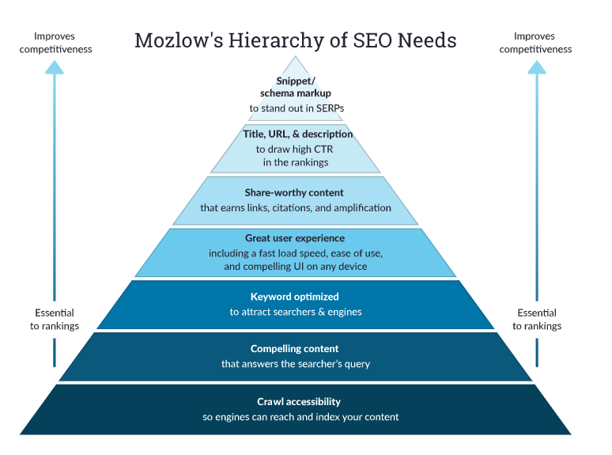

<div align = "center">


```
  So. You want to learn how to properly implement SEO for your website. 
  The question is: how are you going to make things right? 
  Maybe you want your website to look cool and gain traffic. 
  Take it from a guy who's been frozen for 65 years; 
  the only way to really be cool is to follow the rules. 
  We all know what's right. We all know what's wrong.
  Next time those black hat SEO turkeys try to convince you to something that you know is wrong, 
  just think to yourself, 

  'What would Captain America do?'
```

</div>

<p align="center"> 
  All jokes aside, the main point of SEO is to improve your websites visibility, traffic, and rankings.
  This guide already assumes you know what SEO is & how to implement it.
  If you ever feel stuck on trying to optimize your site, follow these guidelines & change your website accordingly. 
  Without further ado...
</p>

<br></br>

## <p align="center"> HERE'S HOW TO DEVELOP AN SEO FRIENDLY WEBSITE </p>

I really enjoyed Moz's guide to SEO. I will try to write this guide in a similar fashion by following
[Mozs Pyramid of Greatness](https://moz.com/beginners-guide-to-seo)
  <div align = "center">
    
  </div>

### <p id = "toc"> Table of Contents </p>
1. [Crawl accessibility](#crawl) so engines can reach and index your content
2. [Compelling content](#compellingContent) that answers the searcher’s query
3. [Keyword optimized](#keywordOptimized) to attract searchers & engines
4. [Great user experience](#GreatUX) including a fast load speed, ease of use, and compelling UI on any device
5. [Share-worthy content](#shareWorthy) that earns links, citations, and amplification
6. [Title, URL, & description](#onsiteOptimazation) to draw high CTR in the rankings
7. [Snippet/schema markup](#snippet/schema) to stand out in SERPs


### <p align="center" id = "crawl"> Crawl Accessibile | [Back to ToC](#toc) </p>

### <p align="center" id = "compellingContent"> Compelling Content | [Back to ToC](#toc) </p>

### <p align="center" id = "keywordOptimized"> Keyword Optimized | [Back to ToC](#toc) </p>

### <p align="center" id = "GreatUX"> Great UX | [Back to ToC](#toc) </p>

### <p align="center" id = "shareWorthy"> Share-Worthy Content | [Back to ToC](#toc) </p>

### <p align="center" id = "onsiteOptimazation"> Title, URL, & Description | [Back to ToC](#toc) </p>

### <p align="center" id = "snippet/schema"> Snippet/Schema Markup | [Back to ToC](#toc) </p>