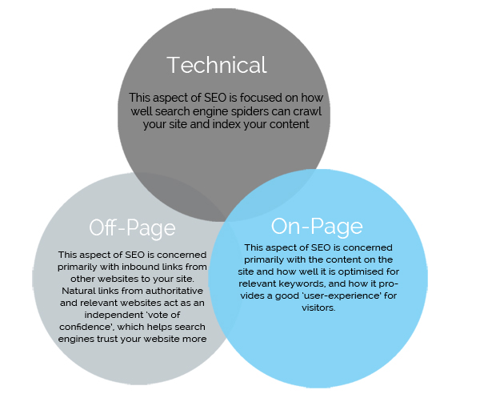

<div align = "center">


```
  So. You want to learn how to properly implement SEO for your website. 
  The question is: how are you going to make things right? 
  Maybe you want your website to look cool and gain traffic. 
  Take it from a guy who's been frozen for 65 years; 
  the only way to really be cool is to follow the rules. 
  We all know what's right. We all know what's wrong.
  Next time any of those black hat SEO turkeys try to convince you to something that you know is wrong, 
  just think to yourself, 

  'What would Captain America do?'
```

</div>

<p align="center"> 
  All jokes aside, the main point of SEO is to improve a websites visibility, traffic, and search rankings.
  Here's a refresher on <a href = "https://www.google.com/search/howsearchworks/">how googles search engine works</a>, 
  <a href = "https://support.google.com/webmasters/answer/35291?hl=en">if you need SEO</a> and
  <a href = "https://www.quicksprout.com/hiring-for-seo/">some questions to ask when hiring for SEO</a>.
  
  <div align = "center">
    <a href = "https://www.quicksprout.com/the-beginners-guide-to-technical-seo/"> 
      
    </a>
  </div>
  
  This guide mainly goes over technical & on-page SEO, and does not go over link building and social media tools.
  Ultimately, this guide is meant for people (like myself) who get stuck on improving a website and ask themselves "How can I make this better?" 
  So without further ado...
</p>

<br></br>

## <p align="center"> HERE'S HOW TO DEVELOP AN SEO FRIENDLY WEBSITE </p>

I really enjoyed [Mozs Beginner's Guide to SEO](https://moz.com/beginners-guide-to-seo), [Mozs SEO Learning Center](https://moz.com/learn/seo/on-site)
& [Googles SEO Starter Guide](https://support.google.com/webmasters/answer/7451184?hl=en). 
All credit for this guide goes to them, because this guide could not have been written without it. 
I can't recommend strongly enough to read through them.

Please note that this guide does not gurantee that your website will rank #1 on your searches. 
By following the guidelines listed in the upcoming chapters, this guide can only help your website gain the potential of being listed on a SERP.

My guide is written by reading Googles guide, and even they say this:
> This guide won't provide any secrets that'll automatically rank your site first in Google (sorry!), 
> but following the best practices outlined below will hopefully make it easier for search engines to crawl, index and understand your content.

Now, this website breaks information in 3 ways:
- [ ] These checkboxes represents tasks that you should actively consider when you go through your website.
> These notes just hold additional information regarding a task.
- [x] This checkbox represents an optional task. 
  This is just something you should think about in the back of your head while you go through your website.

Having said all that, I will try to write this guide in a similar fashion by following Mozs Pyramid of Greatness:

  <div align = "center">
    
  </div>

### <p id = "toc"> Table of Contents </p>
1. [Crawl accessibility](#crawl)
2. [Provide compelling content & optimize keywords](#compellingContentkeywordOptimized)  
3. [Great user experience](#GreatUX)
4. [Share-worthy content](#shareWorthy)
5. [Title, URL, & description](#onsiteOptimazation)
6. [Snippet/schema markup](#snippet/schema)
7. [Additional Resources](#additionalResources)
8. [Tools I Use](#toolsIUse)
9. [Conclusion](#conclusion)


<br></br>
### <p align="center" id = "crawl"> Crawl Accessibile | [Back to ToC](#toc) </p>

<h4>**In short, make sure your website is crawlable so that engines can reach and index your content.**</h4>

- [ ] Make sure you can access every page of your website through internal links. 
      If you want a search engine to find a page, make sure it can be linked from other pages. 
      If the search engine can't find it, it’s as good as invisible. [Source](https://moz.com/beginners-guide-to-seo/how-search-engines-operate)

  <div align = "center">
    
  </div>

- [ ] Check for broken links, and fix any that you find.
Here are some ways I do it:
- https://www.brokenlinkcheck.com/
- https://error404.atomseo.com/
- https://www.drlinkcheck.com/
- [Xenu's Link Sleuth](http://home.snafu.de/tilman/xenulink.html) is a great software tool to find broken links.
- [Screaming Frog](https://www.screamingfrog.co.uk/broken-link-checker/) can also find broken links 
- [x] Although optional, try to create a custom 404 error page like [Mozs Error Page](https://moz.com/404) or [Googles Error Page](http://google.com/error). 
      [Source](https://support.google.com/webmasters/answer/93641)
- [ ] Make sure you also have no broken images. Make sure images include alt attribute. [Source](https://moz.com/learn/seo/alt-text)
	> Note: Alt attributes are not allowed on the anchor tag. It's used for images.
	> [Source](https://stackoverflow.com/questions/14850187/is-it-correct-to-use-alt-tag-for-an-anchor-link)

- [ ] Utilize a XML/HTML sitemap. You can even use [an image sitemap](https://support.google.com/webmasters/answer/178636). 
[Source](https://support.google.com/webmasters/answer/183668?hl=en)
	> Note: You can submit the sitemap.xml file or URL to
	> [Google using the Search Console Sitemaps tool](https://support.google.com/webmasters/answer/7451001) & Bing Webmaster Tools.
- [x] Although it's completely optional, try considering adding breadcrumbs lists to your pages.
Look at <a href = "https://developers.google.com/search/docs/data-types/breadcrumb">what a breadcrumb is</a> and [how it's useful](https://seo.co/breadcrumbs-help-seo/)

- [ ] For the robots.txt file, make sure it correctly suggests which parts of your site search engines should and shouldn't crawl. [Source](https://moz.com/learn/seo/robotstxt)
- [ ] Make sure the noindex meta tag is NOT added if you want it indexed. [Source](https://support.google.com/webmasters/answer/93710?hl=en) 
- [ ] Don't include hidden text and links. [Source](https://support.google.com/webmasters/answer/66353?hl=en)
- [ ] Don't cloak your pages. [Source](https://support.google.com/webmasters/answer/66355?hl=en&ref_topic=6001971)
- [ ] Have ssl enabled. It implies a symbol of trust to your users & search engines alike. [Source](https://webmasters.googleblog.com/2014/08/https-as-ranking-signal.html)
- [ ] Make sure that the DNS is properly set up and both www and non www versions of the site. [Source](https://support.google.com/webmasters/answer/44231?hl=en)
- [ ] Define a canonical page for similar or duplicate pages. 
      [Googles source](https://support.google.com/webmasters/answer/139066) and [Mozs source](https://moz.com/learn/seo/canonicalization)


<br></br>
### <p align="center" id = "compellingContentkeywordOptimized"> Compelling Content & Optimized Keywords | [Back to ToC](#toc) </p>

<h4>**Websites must answer the searcher’s query & be optimized to attract searchers & engines**</h4>

Make sure you write compelling content that best matches the query’s intent. [Source](https://moz.com/learn/seo/on-page-factors)

> "Content is more than just words; it’s anything meant to be consumed by searchers — there’s video content, image content, and of course, text. 
> If search engines are answer machines, content is the means by which the engines deliver those answers."
> [Source](https://moz.com/beginners-guide-to-seo/how-search-engines-operate)

> Remember: "What you want to rank for and what your audience actually wants are often two wildly different things. 
> Focusing on your audience and then using keyword data to hone those insights will make for much more successful campaigns than focusing on arbitrary keywords."
> [Source](https://moz.com/beginners-guide-to-seo/keyword-research)

<h5> DO YOUR KEYWORD RESEARCH </h5>

- [x] Here are some tools that you can use:
  - https://ads.google.com/home/tools/keyword-planner/
  - https://www.semrush.com/
  - https://moz.com/explorer

- [x] Consider targeting long tail keywords. [Source](https://www.semrush.com/blog/how-to-choose-long-tail-keywords/)
- [ ] Don't keyword stuff & add irrelavant content. [Source](https://support.google.com/webmasters/answer/66358?hl=en&ref_topic=6001971)
- [ ] Don't scrape content. [Source](https://support.google.com/webmasters/answer/2721312?hl=en&ref_topic=6001971)
- [ ] Don't add thin content. [Source](https://support.google.com/webmasters/answer/9044175?visit_id=636941329085969070-3801685224&rd=2#thin-content)

- [x] Avoid using duplicate content. Although Google doesn't penalizes people for it, it does limit the amount of unique content you can have. 
      [Source](https://www.hobo-web.co.uk/duplicate-content-problems/).

      With a small fee, you can check for dublicate content by:
      - Checking your site vs itself: https://www.siteliner.com
      - Checking your site vs other websites: https://copyscape.com 

      Screaming Frog also has a great way of showing duplicate content.

> I suggest reading [Moz's resource](https://moz.com/learn/seo/duplicate-content) and 
> [Googles resource](https://support.google.com/webmasters/answer/66359) about duplicate content as well.

- [x] Try to use an h1 tag for page headers or headings to help crawlers identify pages. [Source](https://support.google.com/webmasters/answer/7451184?hl=en#headingtags)
	> Please note that you should use header tags only when it's appropriate. [Source](https://www.youtube.com/watch?v=GIn5qJKU8VM)

- [x] Try to optimize the text content on your homepage so that you have at least 2 paragraphs of unique content.  Build this content based off your keyword research.

- [x] I really liked Rands [talk on 10x content](https://moz.com/blog/how-to-create-10x-content-whiteboard-friday)
      and [his take on "good unique content"](https://moz.com/blog/why-good-unique-content-needs-to-die-whiteboard-friday). 
      I encourage you to read/watch it, but the take away point is this:
> "...the minimum bar today for modern SEO is a step higher, and that is as good as the best in the search results on the search results page. 
> If you can't consistently say, "We're the best result that a searcher could find in the search results," well then, guess what? 
> You're not going to have an opportunity to rank. 
> It's much, much harder to get into those top 10 positions, page 1, page 2 positions than it was in the past 
> because there are so many ranking signals that so many of these websites have already built up over the last 5, 10, 15 years that you need to go above and beyond."


<br></br>
### <p align="center" id = "GreatUX"> Great UX | [Back to ToC](#toc) </p>

<h4>**Websites must include a fast load speed, be easy of use, and have compelling UI on any device**</h4>

- [ ] Make sure pages load fast. [This source](https://moz.com/learn/seo/page-speed) says that it can be done by:
	- Compressing large images for optimal page speeds.
	- Minifing CSS, JavaScript, and HTML code.
	- Reduce how many redirects a page can have.

> I like to test a websites speed through
> [Googles speed test](https://developers.google.com/speed/pagespeed/insights/) and
> [Gtmetrixs speed test](https://gtmetrix.com/). Screaming Frog also shows response times.

- [ ] Make sure your [images](https://support.google.com/webmasters/answer/114016?hl=en&ref_topic=2370565)
and [videos](https://support.google.com/webmasters/answer/156442?hl=en&ref_topic=2370565) are compressed & optimized.

> Please note that some websites can never be as fast as others. 
> Although it sounds obvious, the category of a website limits how fast it can be.
> If you have a website with photo heavy, dynamic content, it can never be as fast as a text only blog.

- [x] From [Chapter 4 of Moz's SEO Guide](https://moz.com/beginners-guide-to-seo/on-page-seo), here are some principles that can promote readability:

  <div align = "center">
    
  </div>

> Try to read [Google’s web accessibility fundamentals.](https://developers.google.com/web/fundamentals/accessibility/)

- [ ] Make sure your website is mobile friendly! Use [this](https://search.google.com/test/mobile-friendly) to test a certain pages mobile friendliness.
Google Search Console provides a [Mobile Usability report](https://support.google.com/webmasters/answer/9063469?hl=en) 
that lets you test your entire website for mobile friendliness.
[Source](https://webmasters.googleblog.com/2016/11/mobile-first-indexing.html) & 
[Source](https://developers.google.com/search/mobile-sites/mobile-seo/)


<br></br>
### <p align="center" id = "shareWorthy"> Share-Worthy Content | [Back to ToC](#toc) </p>
<h4>**Share-worthy content that earns links, citations, and amplification**</h4>

This chapter seems to relate more to [off-page SEO](https://moz.com/learn/seo/off-site-seo). 
Although that is important, that is not the point of this guide.
Having said that, I liked reading [this material from Google](https://webmasters.googleblog.com/2008/10/good-times-with-inbound-links.html) 


<br></br>
### <p align="center" id = "onsiteOptimazation"> Title, URL, & Description | [Back to ToC](#toc) </p>
<h4>**Provide keyword rich page titles, meta descriptions, and headings**</h4>

- [ ] First things first, check your site to see what pages have missing page titles, descriptions and H1 tags (for headings).
      Also check for duplicate page titles, descriptions and H1 tags. 
      [Source](https://www.searchenginejournal.com/important-tags-seo/156440/)
	- I like using [Screaming Frog](https://www.screamingfrog.co.uk/seo-spider/) to do this.
	- [BeamUsUp](http://beamusup.com/) is apparently another tool that you can use. Please note that you will need to have Java installed on your machine to use it.

> Emphasize important text through heading tags, but please use it sparingly. Use h1 tags for page headings.
> [Source](https://support.google.com/webmasters/answer/7451184?hl=en#headingtags)

> NEVER pay attention to the keywords meta tag. 
> But make sure you target relevant key words when you pay attention to the meta description tag.
> [Googles Source](https://support.google.com/webmasters/answer/79812) & [Mozs Source](https://moz.com/learn/seo/meta-description)
> Also, [meta descriptions can improve snippets](https://webmasters.googleblog.com/2007/09/improve-snippets-with-meta-description.html)

> Lastly, properly name your urls/page titles.
> [Googles source](https://support.google.com/webmasters/answer/35624?hl=en) &
> [Mozs source](https://moz.com/learn/seo/title-tag)

<br>

- [ ] Google doesn't see a big advantage at what the URL structure itself looks like i.e. if there's multiple slashes & nested paths in URLs.
	It however DOES care about crawl depth or how many links someone has to click through to actually get to that content.
	[This source](https://www.searchenginejournal.com/google-click-depth-matters-seo-url-structure/256779/)
	explains [this](https://www.youtube.com/watch?v=zyQbNGUycX8) video at the 31:09 mark.
> Having said all that, it's still good UX if we keep URL paths short & relevant. 
> [Googles source](https://support.google.com/webmasters/answer/7451184?hl=en#hierarchy) & [Mozs source](https://moz.com/learn/seo/url)

- [x] To reiterate the point above, page depth (the number of clicks you need to reach a specific page from the homepage) does affect SEO.
      [Source](https://www.oncrawl.com/oncrawl-seo-thoughts/page-depth-how-it-affects-your-seo-performance/)

- [ ] You can use [this](https://support.google.com/webmasters/answer/9012289) tool to inspect your URLs.


<br></br>
### <p align="center" id = "snippet/schema"> Snippet/Schema Markup | [Back to ToC](#toc) </p>
<h4>**Stand out in SERPs by having structured data(This chapter is optional)**</h4>

> "There's no generic ranking boost for SD usage. That's the same as far as I remember. 
> However, SD can make it easier to understand what the page is about, 
> which can make it easier to show where it's relevant (improves targeting, maybe ranking for the right terms). (not new, imo)".
> [Source](https://twitter.com/JohnMu/status/980902538865205248)

- [ ] Refresh your memory of schemas by reading [Mozs](https://moz.com/learn/seo/schema-structured-data) and 
[Googles](https://developers.google.com/search/docs/guides/intro-structured-data) guides.  
	- When making a schema, follow the 
	[general structured data guidelines](https://developers.google.com/search/docs/guides/sd-policies) 
	that Google provides. 
	Google recommends using the [JSON-LD format](https://json-ld.org) for structured data.  
	- You can use various tools to make a schema.
	I would recommend using Googles tools, specifically: 
	[Googles Structured Data Markup Helper](https://support.google.com/webmasters/answer/3069489?hl=en)
	OR [Googles Data Highlighter](https://support.google.com/webmasters/answer/2692911?hl=en).
	Having said that, here are more tools you can use:
		- https://hallanalysis.com/json-ld-generator/
		- https://technicalseo.com/tools/schema-markup-generator/
	- Test your schema using [Googles Structed Data Testing Tool](https://search.google.com/structured-data/testing-tool/u/0/).

- [ ]	Read [this](https://developers.google.com/search/docs/guides/mark-up-content) to learn how to implement rich snippets.
	If you don't feel like reading, try watching [this video from Moz](https://moz.com/blog/target-featured-snippet-opportunities)
	that basically states how to format your page to make it show up in featured snippets.
> Try to test your website for rich results [here](https://search.google.com/test/rich-results).
> Google Search Console also provides [rich result status reports](https://support.google.com/webmasters/answer/7552505)


<br></br>
### <p align="center" id = "additionalResources"> Additional Resources | [Back to ToC](#toc) </p>
- [x] I liked reading [this moz guide](https://moz.com/learn/seo/building-local-business-website)
      which links to [this checklist](https://moz.com/blog/technical-site-audit-for-2015).
- [x] Moz had 2 good white board friday blogs that talked about essential SEO plans.
      You can check it [here](https://moz.com/blog/launching-new-website-seo-checklist-whiteboard-friday) and 
      [here](https://moz.com/blog/on-page-seo-2019).
- [x] SEMrush also had some good sources. Check [this general guide](https://www.semrush.com/kb/810-technical-seo)
      and [this blog](https://www.semrush.com/blog/learning-technical-seo/) out.


<br></br>
### <p align="center" id = "toolsIUse"> Tools I Use | [Back to ToC](#toc) </p>
<h4>**If you don't want to read the text above, then just take a look at a few tools that I've grown fond of**</h4>

- [x] If you haven't noticed already, I really like using Screaming Frog.
      Learn more about the data that's listed in the tabs [here](https://www.screamingfrog.co.uk/seo-spider/user-guide/tabs/).
- [x] Use [this](https://serpsim.com/) tool if you want to see how your page might look on a SERP.
- [x] If you search on google " source: 'Your URL' ", you should see various pages from your website on the SERP.
- [x] Use [Google Analytics](https://analytics.google.com/analytics/web/) 
      and [Google Tag Manager](https://support.google.com/tagmanager/answer/6103696?hl=en) to track and analyze data about clients' website traffic, audience and user interaction. 
      You can then use this data for business marketing decisions. 
- [x] You can visualize data analysis results using [Google Search Console](https://support.google.com/webmasters/answer/7576553)
- [x] I mainly check brokens links through [this Broken Link Checker](https://www.brokenlinkcheck.com/)
- [x] I use [SEMRUSH](https://www.semrush.com/) for keyword research.
- [x] I mainly use [this](http://gtmetrix.com/) & ScreamingFrog as my go to website speed test.
- [x] Use [Googles Structured Data Testing Tool](https://search.google.com/structured-data/testing-tool/u/0/) to test your schema.


<br></br>
### <p align="center" id = "conclusion"> Conclusion | [Back to ToC](#toc) </p>

As search engines get better & better at crawling pages, it's important to treat them like users.
If a person has a hard time using your website, your search engine wouldn't have any better luck.

- [x] To rank well, you need to build a "good" website around your users. I think a good website:
	- has no broken links 
	- is organized (easy to navigate through, crawlable & has good UX)
	- has relevant and useful content (including optimized meta/structured data!)
	- loads quickly
	- is desktop & mobile friendly

Having said that, you should of course allocate some of your efforts to off-page SEO. 
But again, the bare minimum to rank well on Google is to first make sure your website works properly.

<br></br>
Thanks for reading my guide! If you'd like to correct or add something, or if you just want to say hi, you can reach me at
<a href = "mailto:Razat51@gmail.com" target = "_blank">Razat51@gmail.com</a>  